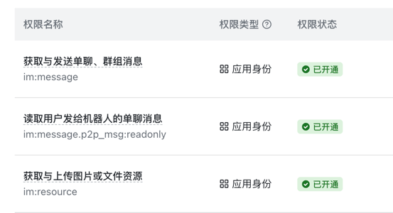
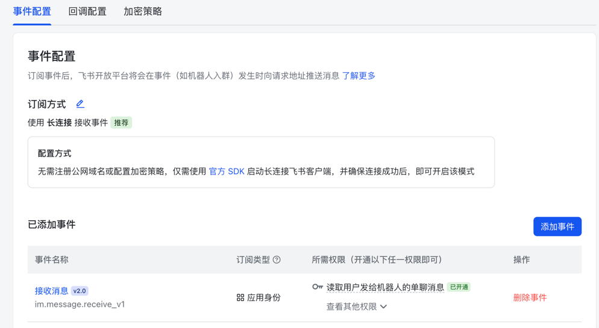

# StickerHub

StickerHub 是一个 Telegram 表情素材（Sticker/Image/GIF/Video）转换与获取工具，支持可选的飞书转发功能。


## 功能范围

### Telegram 核心功能（无需飞书配置）

- 发送单个贴纸，机器人自动回复转换后的原始图片（可直接保存到相册）
- 发送单个贴纸后，可选择整包获取方式：
  - **📦 下载 ZIP 包**：全部转换后打包为 ZIP 文件发送
  - **🖼 Telegram 图片组**：以图片组形式发送，方便批量保存
- 支持贴纸格式自动转换：
  - 视频/动图 → GIF（保留透明背景）
  - TGS 动态贴纸 → GIF
  - WebP 静态图 → PNG
- 发送过程中可点击「停止发送」按钮，任务在当前批次结束后停止

### 飞书转发功能（可选）

配置飞书应用后，额外支持：

- `/bind` 双模式绑定（飞书机器人 / 飞书自定义机器人 Webhook）
- 绑定模式二选一：切换后仅新配置生效
- 单个贴纸自动转发到飞书
- 整包发送时可选「📤 发送到飞书」，按每批 10 个并发发送
- 飞书事件接收方式：**长连接（Long Connection）**，项目不对外开放 HTTP 端口

## 环境要求

- Python 3.13
- [uv](https://docs.astral.sh/uv/)
- Docker + Docker Compose（推荐部署方式）
- `ffmpeg`（Docker 镜像已内置）
- `lottie_convert.py`（由 `lottie` 依赖提供）

## 配置环境变量

复制示例文件：

```bash
cp .env.example .env
```

编辑 `.env`：

```env
TELEGRAM_BOT_API_TOKEN=...

# 飞书配置（可选，留空则仅使用 Telegram 功能）
FEISHU_APP_ID=
FEISHU_APP_SECRET=

BINDING_DB_PATH=data/stickerhub.db
BIND_MAGIC_TTL_SECONDS=600

# 飞书 Webhook 域名白名单（JSON 格式的字符串数组）
# 不设置：使用默认白名单 ["open.feishu.cn","open.larksuite.com"]
# 设为 []：禁用白名单校验（允许任意域名，请谨慎使用）
# 设为自定义列表：如 ["open.feishu.cn","custom.domain.com"]
FEISHU_WEBHOOK_ALLOWED_HOSTS=

LOG_LEVEL=INFO
```

说明：

- `TELEGRAM_BOT_API_TOKEN`：必填，Telegram Bot API Token
- `FEISHU_APP_ID` / `FEISHU_APP_SECRET`：可选，填写后启用飞书转发和 `/bind` 功能（包括 webhook 绑定所需的图片上传能力）
- `FEISHU_WEBHOOK_ALLOWED_HOSTS`：飞书 Webhook 域名白名单（JSON 格式，防止 SSRF 攻击）
  - 不设置：使用默认白名单 `["open.feishu.cn", "open.larksuite.com"]`
  - 设为 `[]`：禁用白名单校验（允许任意域名，**请谨慎使用**）
  - 设为自定义列表：如 `["open.feishu.cn", "custom.domain.com"]`
- 飞书需在应用后台开启机器人收发消息权限(im:message)以及获取与上传图片或文件资源权限(im:resource) 
- 飞书事件添加接收消息(im.message.receive_v1)并启用长连接事件能力。 


## 使用 Docker Compose 部署（默认拉取 GHCR 镜像）

```bash
docker compose up -d
```

查看日志：

```bash
docker compose logs -f stickerhub
```

默认会拉取并运行：`ghcr.io/akkialab/stickerhub:latest`。

## 本地构建测试（不依赖远程镜像）

```bash
docker compose -f docker-compose.local.yml up -d --build
```

查看日志：

```bash
docker compose -f docker-compose.local.yml logs -f stickerhub
```

## 绑定流程（需配置飞书 App）

1. 在 Telegram 发送：`/bind`
2. 选择绑定方式：
   - `飞书机器人`：走魔法字符串绑定
   - `飞书 Webhook`：输入飞书自定义机器人的 webhook 地址
3. `飞书机器人`流程：
   - Telegram 返回魔法字符串
   - 在飞书机器人里发送 `/bind <魔法字符串>` 完成绑定
4. `飞书 Webhook`流程：
   - Telegram 提示输入 webhook 地址
   - 输入后立即生效，后续素材通过 webhook 发送
5. 两种绑定方式互斥，切换后仅新方式生效

> 注意：未配置 `FEISHU_APP_ID` / `FEISHU_APP_SECRET` 时，不支持飞书 webhook 绑定与飞书转发。

## 已知限制

- 个别复杂 `TGS` 贴纸可能因渲染差异转换失败。
- 飞书侧的表情“入库”仍需用户手动执行（本阶段目标如此）。
